# AppFlow · Martha Rdz Hair Artist

**Última revisión:** 2026-10-05 · **Versión de la app:** v50 · **Tablero interactivo:** [AppFlow.html](AppFlow.html) (arrastra, acerca y aleja como en Miro)

Este documento sigue cada acción desde que la persona toca algo hasta donde
termina: qué pantalla la recibe, qué endpoint llama, qué tablas toca, qué ve
al final y por qué caminos se puede desviar. Sirve para encontrar lo que
está suelto o sin resolver. Esos hallazgos viven al final, en
[Cabos sueltos](#cabos-sueltos). Los 14 primeros se resolvieron en la v46.
C15 a C17 están abiertos: son datos que dejó la Agenda y falta decidirlos
con la dueña.

**v50: se retiró la Agenda.** F4, F5 y F6 se quedan aquí como "retirado"
para que sus números no cambien y los cabos sueltos que apuntan a ellos
sigan llevando a algún lado. Los anticipos que la Agenda dejó registrados
tienen su propio flujo nuevo: [F14](#f14--anticipos-que-dejó-la-agenda).

**Cómo leer los diagramas:** los rectángulos son pantallas o pasos, los
rombos son decisiones y los cilindros son tablas. En los textos,
`👑` = solo dueña, `👤` = dueña y trabajadora.

## Índice

| # | Flujo | Quién |
|---|---|---|
| F0 | [Arranque y navegación](#f0--arranque-y-navegación) | 👤 |
| F1 | [Entrar con PIN](#f1--entrar-con-pin) | 👤 |
| F2 | [Face ID / Touch ID](#f2--face-id--touch-id) | 👤 |
| F3 | [Registrar Cita](#f3--registrar-cita) | 👤 |
| F4 | [Agendar Cita](#f4--agendar-cita--retirado-en-v50) | Retirado en v50 |
| F5 | [Ciclo de vida de una cita agendada](#f5--ciclo-de-vida-de-una-cita-agendada--retirado-en-v50) | Retirado en v50 |
| F6 | [Vacaciones y días libres](#f6--vacaciones-y-días-libres--retirado-en-v50) | Retirado en v50 |
| F7 | [Registrar Gasto](#f7--registrar-gasto) | 👑 |
| F8 | [Registros del día](#f8--registros-del-día) | 👑 |
| F9 | [Clientas](#f9--clientas) | 👑 |
| F10 | [Reportes: inicio, comisiones, dashboard](#f10--reportes) | 👑 |
| F11 | [Configuración](#f11--configuración) | 👑 |
| F12 | [Notificaciones push](#f12--notificaciones-push) | 👑 recibe |
| F13 | [Actualización de la app](#f13--actualización-de-la-app) | 👤 |
| F14 | [Anticipos que dejó la Agenda](#f14--anticipos-que-dejó-la-agenda) | 👤 aplica · 👑 elimina |
| | [Mapa del dinero](#mapa-del-dinero) | |
| | [Cabos sueltos](#cabos-sueltos) | |

## F0 · Arranque y navegación

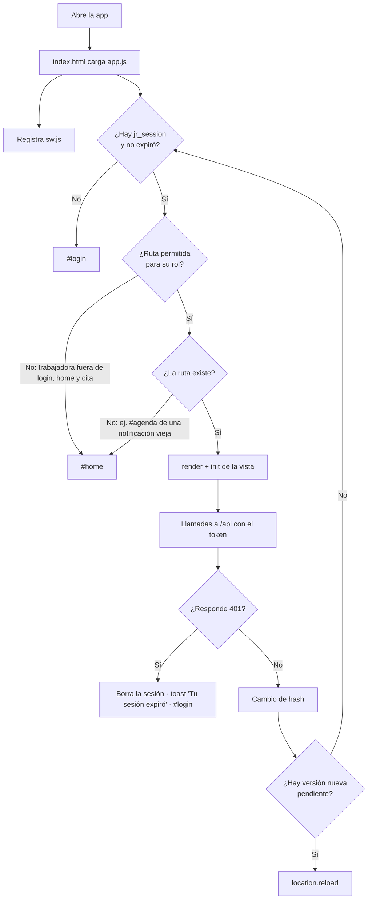

- **Entrada:** abrir la app o cambiar de hash.
- **Termina en:** la vista pedida, `#login` o `#home`.
- **Rutas de la trabajadora:** `login`, `home` y `cita` (`RUTAS_TRABAJADORA`). Desde la v50 ya no existen `agenda` ni `agendar`.
- **Aristas:** sesión expirada en el navegador → login. Rol sin permiso → inicio. Ruta que ya no existe (ej. `#agenda` de un acceso o una notificación de antes) → inicio, en vez de pantalla en blanco. Token vencido en el servidor (401) → login con aviso.
- **Regla:** la expiración local sale del propio token, así que las dos siempre coinciden ([C4](#c4), resuelto).

## F1 · Entrar con PIN

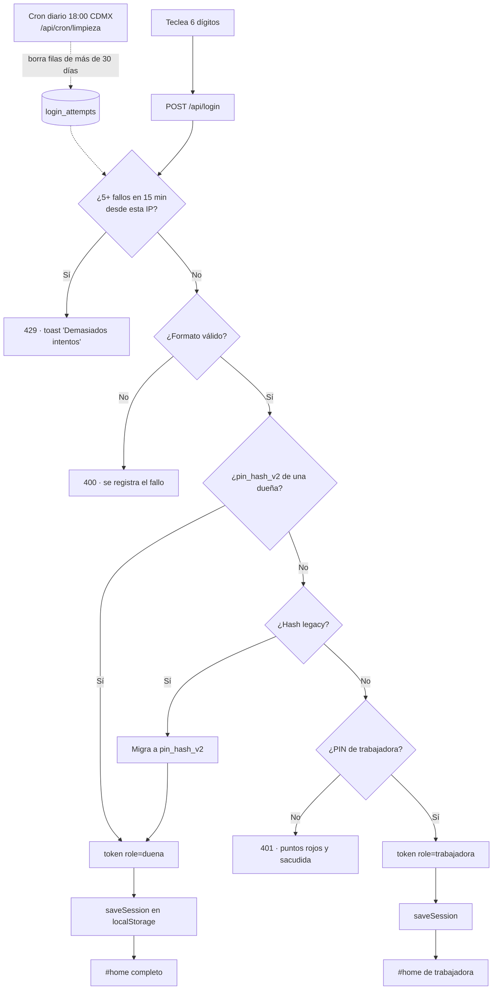

- **Tablas:** `login_attempts` (lee y escribe), `salones` (lee; escribe `pin_hash_v2` si migra).
- **Cron:** desde la v50 el cron diario es `/api/cron/limpieza` (antes `/api/cron/reminder-citas`) y solo hace esto ([C12](#c12), resuelto).
- **Termina en:** inicio según el rol, o error en login.

## F2 · Face ID / Touch ID

**Activar (👑 desde Configuración, con sesión de PIN):**

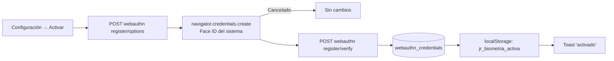

**Entrar:**

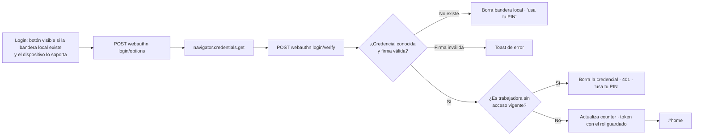

- **Quitar:** Configuración → Quitar → `DELETE /api/webauthn`. Si era este dispositivo, borra la bandera local.
- **Revocación:** quitarle el acceso a una trabajadora (o borrarla en Configuración) borra sus credenciales, y el login revisa que siga con acceso ([C8](#c8), resuelto).

## F3 · Registrar Cita

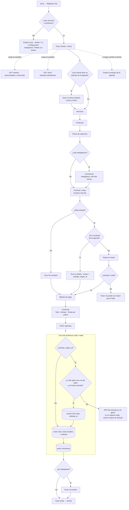

- **Entrada:** nombre, fecha, items con precio, comisiones, nota, anticipo y método de pago.
- **Pasos:** clienta → servicios → productos → precios → comisiones → notas → **anticipo** (nuevo en v50) → pago → confirmar. Servicios, productos y comisiones se saltan si el salón no los tiene.
- **Anticipo dentro del total:** una cita de $2,500 con $500 de anticipo se guarda con `total = 2500` y `anticipo = 500`. Los $2,500 cuentan como ingreso el día de la cita y las comisiones salen sobre el precio completo. Confirmar muestra Total, Anticipo y "Resta por cobrar" ($2,000).
- **Candado del monto:** el anticipo nunca puede ser mayor que el total. Lo revisan el paso de anticipo, Confirmar (por si cambiaron precios después), la API (400) y la base (`citas_anticipo_valido`).
- **Anticipo de la Agenda:** si la clienta tiene uno pendiente ([F14](#f14--anticipos-que-dejó-la-agenda)), se avisa en el primer paso y se ofrece en una tarjeta en el paso de anticipo. Al tocarla, el monto es el de esa fila. Si después se escribe otra clienta, ese anticipo se suelta ([C7](#c7)). Si otro dispositivo ya lo aplicó, el POST responde 409, la app refresca la lista y regresa al paso de anticipo.
- **Tablas:** `citas` (insert, y update de la fila vieja del anticipo), `comisiones` (insert), `push_subscriptions` (lee).
- **Termina en:** inicio con toast verde. En error, se queda en Confirmar con el botón reactivado.
- **Ya no existe (v50):** el recuadro de citas agendadas, `agenda_id` y abrir el flujo en otro día con `#cita?fecha=`.
- **Resueltos:** [C3](#c3) (la cita, sus comisiones y la fila vieja del anticipo van en una sola sentencia), [C7](#c7) (el anticipo de otra clienta se suelta), [C10](#c10) (mensaje para la trabajadora sin catálogo).

## F4 · Agendar Cita — retirado en v50

Se retiró con la Agenda. Ya no se agendan citas: se registran a mano en
[F3](#f3--registrar-cita), y el anticipo se captura ahí. Los anticipos que
se cobraron al agendar siguen vivos en su día ([F14](#f14--anticipos-que-dejó-la-agenda)).
Con ella se fueron `POST /api/citas-agendadas`, el teléfono al agendar y el
permiso "Teléfonos de clientas". La tabla `citas_agendadas` se queda en la
base, sin uso. Cabo suelto ligado: [C2](#c2).

## F5 · Ciclo de vida de una cita agendada — retirado en v50

Se retiró con la Agenda: ya no hay estados pendiente, completada,
cancelada ni no asistió, ni sección "Sin cerrar", ni "Confirmar por
WhatsApp". Los estados que quedaron guardados en `citas_agendadas` no se
usan. Cabos sueltos ligados: [C1](#c1) y [C14](#c14). Lo que sí sigue
teniendo un ciclo es el anticipo que dejó la Agenda: ver
[F14](#f14--anticipos-que-dejó-la-agenda).

## F6 · Vacaciones y días libres — retirado en v50

Se retiró con la Agenda. La tabla `ausencias` se queda en la base, sin
uso. Cabo suelto ligado: [C11](#c11).

## F7 · Registrar Gasto

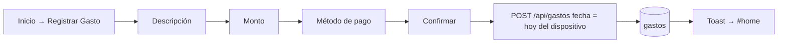

## F8 · Registros del día

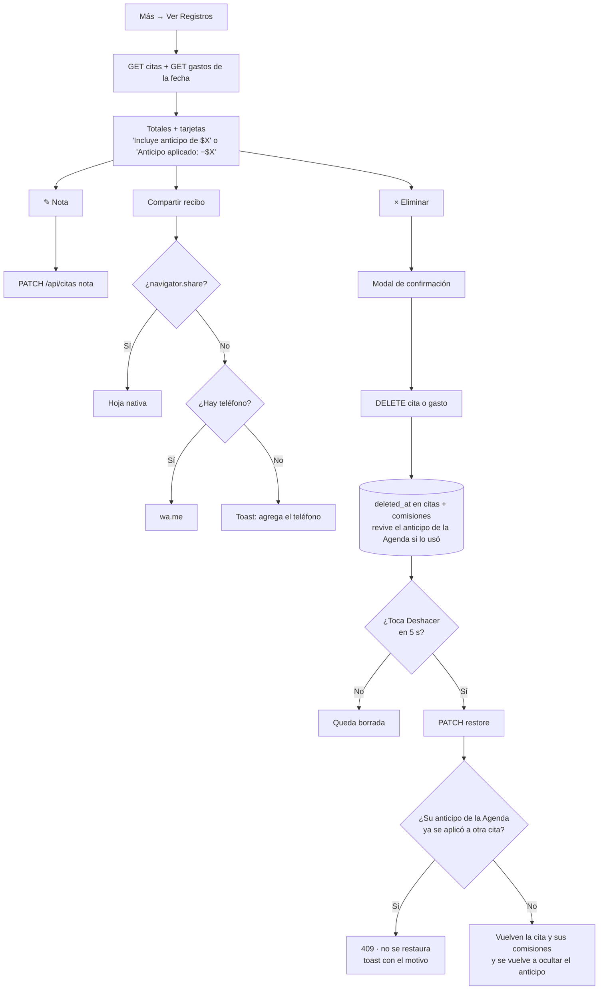

- **Anticipo en la tarjeta:** una cita de la v50 con anticipo dice "Incluye anticipo de $X" (va dentro del total). Un cobro viejo de la Agenda dice "Anticipo aplicado: −$X" (ese total se guardó ya restado). Una fila de solo anticipo muestra su desglose.
- **Recibo:** si la cita trae anticipo, agrega "Anticipo" y "Resto pagado".
- **Eliminar una cita que aplicó un anticipo de la Agenda:** la fila del anticipo regresa a su día original como pendiente, en la misma sentencia ([F14](#f14--anticipos-que-dejó-la-agenda)). El dinero sí se recibió; solo la cita fue un error.
- **Deshacer:** vuelve a ocultar ese anticipo. Si mientras tanto se aplicó a otra cita, responde 409 y la app muestra el motivo, para no contarlo dos veces.

## F9 · Clientas

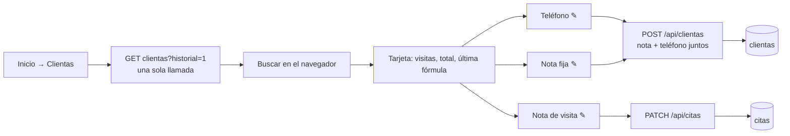

- Las filas de solo anticipo de la Agenda no cuentan como visita.
- Solo la dueña. Desde la v50 la trabajadora nunca recibe teléfonos y el `POST` le responde 403 (se retiró el permiso "Teléfonos de clientas").

## F10 · Reportes

| Pantalla | Llamadas | Rango |
|---|---|---|
| Inicio (resumen) | `GET dashboard` + `GET comisiones` | Lunes a domingo de esta semana |
| Comisiones | `GET comisiones` | Editable. Default: semana actual |
| Dashboard | `GET dashboard` | Mes elegido. Mes actual llega hasta hoy |

Si el resumen del inicio falla, la tarjeta se oculta (no muestra error).
Cómo cuenta cada peso: ver [Mapa del dinero](#mapa-del-dinero).

## F11 · Configuración

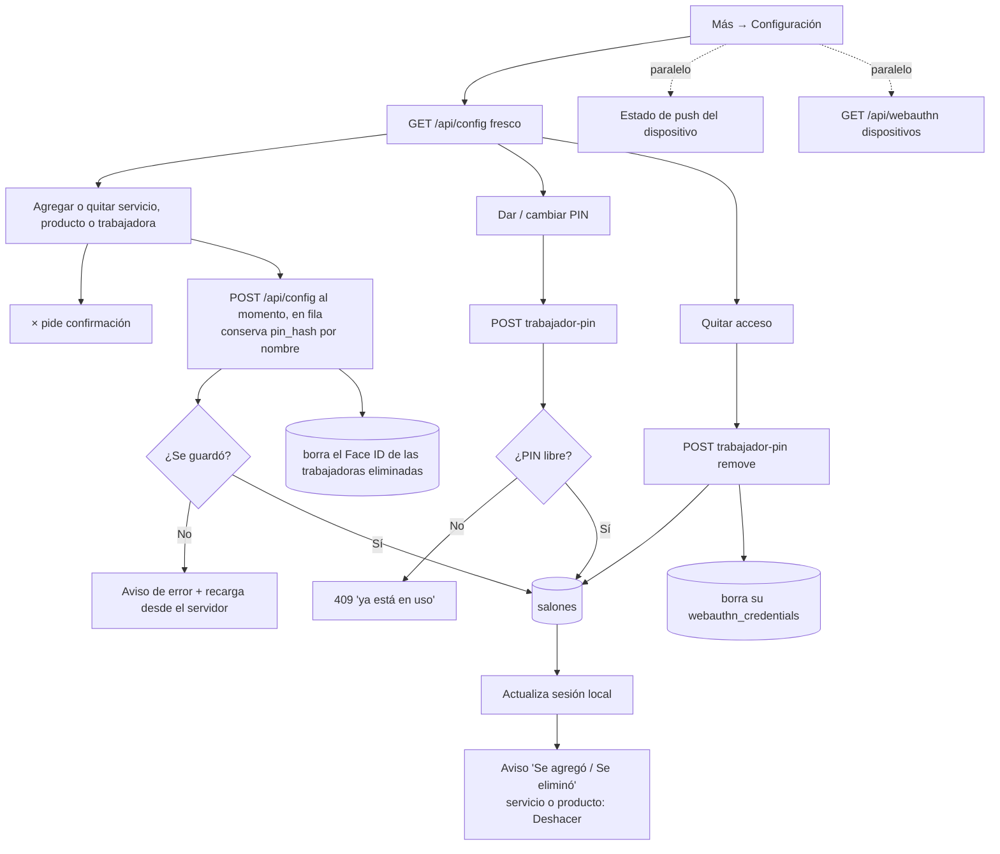

- **Sin botón "Guardar":** cada alta o baja se guarda sola. Los guardados van en fila y cada uno manda el catálogo completo, así dos cambios rápidos no se pisan.
- **Trabajadora recién agregada:** darle PIN espera a que termine su guardado (antes necesitaba "Guardar Cambios" o daba 404).
- **Permisos:** hoy no hay ninguno, así que la sección "Puede usar" no aparece. "Teléfonos de clientas" se retiró en la v50 junto con la Agenda; lo que quedó guardado en `salones.trabajadoras[].permisos` ya no vale. Un permiso nuevo se agrega en `PERMISOS_TRABAJADORA` (`lib/auth.js`) y en `PERMISOS` (`public/js/views/config.js`).
- **Deshacer:** solo para servicios y productos. Quitar a una trabajadora le borra PIN y Face ID en el servidor, por eso no se ofrece.
- **PIN libre:** se revisa contra dueñas (hash nuevo y legacy) y trabajadoras de todos los salones, excepto ella misma.
- **Resueltos:** [C4](#c4) (guardar ya no alarga la sesión local), [C6](#c6) (PIN único en todo el sistema), [C8](#c8) (quitar acceso corta también su Face ID).

## F12 · Notificaciones push

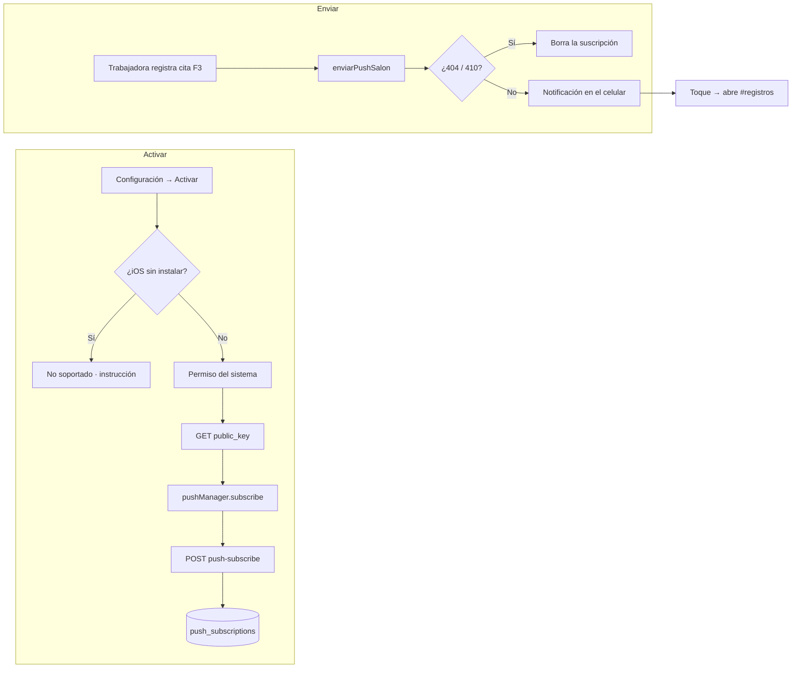

- **Único aviso:** "Nueva cita registrada" cuando una trabajadora registra una cita.
- **Retirado en v50:** el recordatorio diario de "citas de mañana". Una notificación vieja que abra `#agenda` lleva al inicio ([F0](#f0--arranque-y-navegación)).

## F13 · Actualización de la app

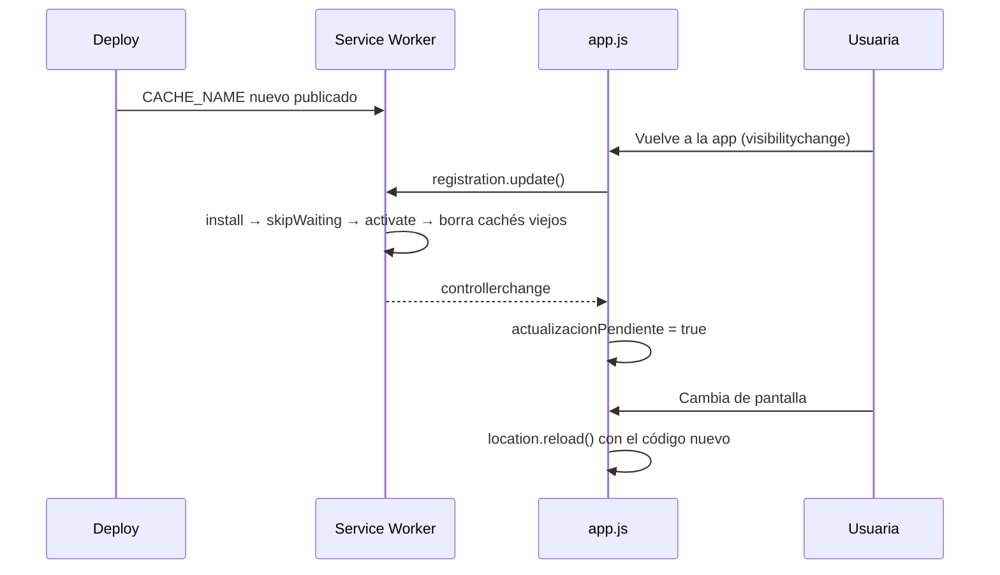

"Actualizar app" (Configuración o inicio de la trabajadora) hace lo mismo
al momento: `update()`, espera hasta 8 s a que el SW nuevo se active y recarga.

## F14 · Anticipos que dejó la Agenda

Antes de la v50, la Agenda guardaba cada anticipo como una fila propia de
`citas` (un solo item `{tipo: 'anticipo'}`) el día que se pagaba. Las que
siguen vivas son **anticipos pendientes**: cuentan como ingreso de su día
hasta que se aplican a una cita.

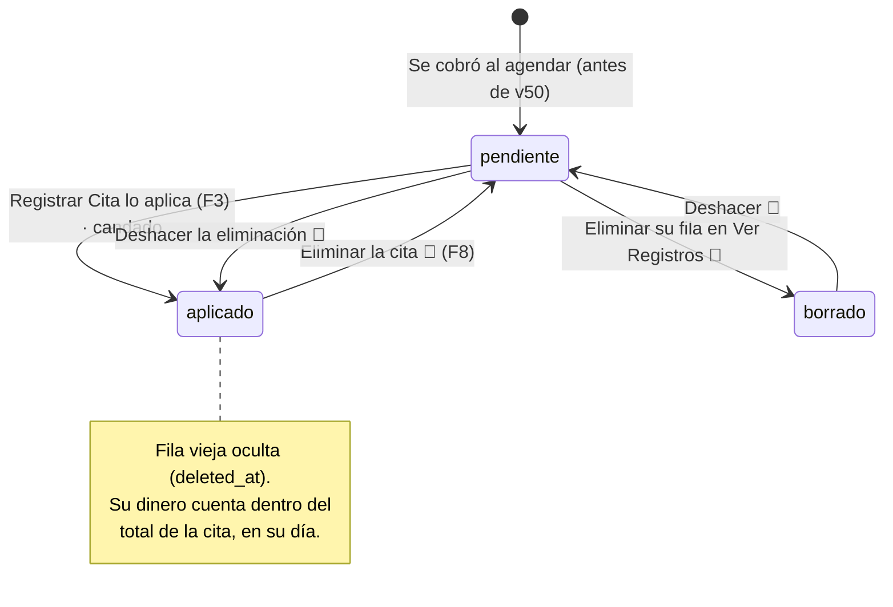

| Transición | Cómo | Endpoint | Efecto en el dinero |
|---|---|---|---|
| Pendiente → aplicado | Registrar Cita: "Ya tiene anticipo" y tocar su tarjeta (👤) | `POST /api/citas` con `anticipo_origen_id` | Sale de su día y cuenta dentro del total de la cita |
| Pendiente → aplicado, ya usado | Otro dispositivo lo aplicó primero | `POST` → 409 | No se registra nada; la app regresa al paso de anticipo |
| Aplicado → pendiente | Eliminar la cita en Ver Registros 👑 | `DELETE /api/citas` | Regresa a su día original como pendiente |
| Pendiente → aplicado (Deshacer) | "Deshacer" en el aviso 👑 | `PATCH {restore}` | Vuelven la cita y sus comisiones, y se oculta otra vez |
| Deshacer con el anticipo ya usado | Se aplicó a otra cita mientras tanto | `PATCH {restore}` → 409 | La cita no se restaura (se contaría dos veces) |
| Pendiente ↔ borrado | Eliminar su fila en Ver Registros / Deshacer 👑 | `DELETE` / `PATCH {restore}` | Sale o vuelve a los ingresos de su día |

- **Lista:** `GET /api/citas?anticipos=pendientes` → `[{id, clienta, fecha, monto}]`. La trabajadora también la puede pedir: la necesita para registrar bien la cita.
- **Candado:** al registrar la cita, la fila vieja se oculta en **la misma sentencia** que inserta la cita, y solo si sigue viva, es del mismo salón y el monto coincide. Si no, responde 409 y no inserta nada. Así el mismo anticipo no se aplica dos veces.
- **Termina en:** el anticipo dentro de una cita, o pendiente en su día.
- **Cabos ligados:** [C3](#c3) (el candado va en la misma sentencia que la cita) y [C7](#c7) (el anticipo de otra clienta se suelta).

## Mapa del dinero

Dónde entra y dónde sale cada peso, y cómo se refleja en cada pantalla.

**Ingresos = suma de `total` de las citas vivas** (sin `deleted_at`). El
anticipo va **dentro** del total, nunca se suma aparte. Una fila de solo
anticipo de la Agenda cuenta en su día hasta que se aplica a una cita.

| Evento | Fila en `citas` | `fecha` | Registros | Dashboard ingresos | Dashboard citas | Comisiones |
|---|---|---|:---:|:---:|:---:|:---:|
| Cita sin anticipo | 1 (servicios y productos), `anticipo = 0` | La elegida | ✅ | ✅ total | ✅ | Si se asignaron |
| Cita con anticipo (v50) | 1, `total` = precio completo, `anticipo` dentro | La elegida | ✅ "Incluye anticipo de $X" | ✅ total completo | ✅ | Sobre el precio completo |
| Anticipo de la Agenda pendiente | 1 (item `anticipo`) | El día que se pagó | ✅ | ✅ | ❌ | ❌ |
| Cita que aplica ese anticipo | Inserta la cita y oculta la fila del anticipo | La de la cita | ✅ la cita; el anticipo sale de su día | ✅ total completo en el día de la cita | ✅ | Sobre el precio completo |
| Eliminar esa cita | Borra la cita y revive la fila del anticipo | El anticipo vuelve a su día | El anticipo reaparece | Solo el anticipo, en su día | ❌ | Se borran |
| Cobro viejo de la Agenda (antes de v50) | 1, `total` ya restado (`anticipo_aplicado`) | La elegida | ✅ "Anticipo aplicado: −$X" | ✅ el neto (el anticipo cuenta en su fila) | ✅ | Sobre el precio completo |
| Eliminar cita en Registros | Borra la fila | | | | | Se borran |
| Gasto | `gastos` | Hoy del dispositivo | ✅ | Gastos | | |

`Ganancia neta = ingresos − gastos − comisiones`.

Datos de la Agenda que hoy no cuadran con esta tabla: [C15](#c15),
[C16](#c16) y [C17](#c17).

## Cabos sueltos

Lo que al recorrer los flujos quedó abierto, ambiguo o inconsistente.
**C1 a C14 se resolvieron en la v46** (2026-09-26). Cada uno tiene su prueba
automática o su recorrido en navegador (ver [Testing.md](Testing.md)).
C1, C2, C11 y C14 eran de la Agenda: en la v50 se retiró, así que ya no
aplican. **C15 a C17 están abiertos:** son datos reales que dejó la Agenda,
pendientes de decidir con la dueña. Si aparece uno nuevo, agrégalo como C18
con estado "Abierto".

| # | Prioridad | Flujo | Estado |
|---|---|---|---|
| [C15](#c15) | 🔴 Alta | Datos | ⏳ Abierto · pendiente de decidir con la dueña |
| [C16](#c16) | 🟠 Media | Datos | ⏳ Abierto · pendiente de decidir con la dueña |
| [C17](#c17) | 🟠 Media | Datos | ⏳ Abierto · pendiente de decidir con la dueña |
| [C1](#c1) | 🔴 Alta | F5 (retirado) | ✅ Resuelto (v46) · v50: se retiró la Agenda |
| [C2](#c2) | 🔴 Alta | F4 (retirado) | ✅ Resuelto (v46) · v50: se retiró la Agenda |
| [C3](#c3) | 🟠 Media | F3 | ✅ Resuelto (v46) |
| [C4](#c4) | 🟠 Media | F0, F11 | ✅ Resuelto (v46) |
| [C5](#c5) | 🟠 Media | Operación | ✅ Resuelto (v46) |
| [C6](#c6) | 🟠 Media | Operación | ✅ Resuelto (v46) |
| [C7](#c7) | 🟠 Media | F3 | ✅ Resuelto (v46) |
| [C14](#c14) | 🟠 Media | F5 (retirado) | ✅ Resuelto (v46) · v50: se retiró la Agenda |
| [C8](#c8) | 🟡 Baja | F2, F11 | ✅ Resuelto (v46) |
| [C9](#c9) | 🟡 Baja | Todos | ✅ Resuelto (v46) |
| [C10](#c10) | 🟡 Baja | F3 | ✅ Resuelto (v46) |
| [C11](#c11) | 🟡 Baja | F6 (retirado) | ✅ Resuelto (v46) · v50: se retiró la Agenda |
| [C12](#c12) | 🟡 Baja | F1 | ✅ Resuelto (v46) |
| [C13](#c13) | 🟡 Baja | Base de datos | ✅ Resuelto (v46) |

### C15

**Victoria G está registrada dos veces el 2026-09-29.** Hay dos citas de
$1,980 cada una: una capturada a mano y otra que vino del cobro en la
Agenda. Si es la misma visita, los ingresos de ese día traen $1,980 de más
(y las comisiones, si se asignaron en las dos).
**Pendiente de decidir con la dueña:** si fue una sola visita, eliminar
una de las dos en Ver Registros (se borran también sus comisiones).

### C16

**Ximena Gonzalez, 2026-09-30: sus $250 de anticipo no cuentan en ningún
lado.** Su cita se cobró desde la Agenda con total $0 y
`anticipo_aplicado = 250`, y la fila de ese anticipo está borrada. Como el
cobro guardó el total ya restado y el anticipo no está vivo, esos $250 no
aparecen en ingresos.
**Pendiente de decidir con la dueña:** si sí se recibieron, restaurar la
fila del anticipo o corregir el total de la cita.

### C17

**Natalia Mireles y Mon aguilera salen "completada" en `citas_agendadas`
pero sus cobros están borrados.** La Agenda las marcó como cobradas, pero
las filas del cobro en `citas` tienen `deleted_at`. Hoy esos estados ya no
se ven en la app (la Agenda se retiró), así que esas visitas no cuentan en
ingresos.
**Pendiente de decidir con la dueña:** si las visitas sí ocurrieron y se
cobraron, restaurar los cobros; si no, dejarlos borrados.

### C1

**Eliminar una cita agendada ya completada borra también el cobro de la visita.**
`DELETE /api/citas-agendadas` marca como borradas todas las filas de `citas`
con ese `agenda_id`. El cobro final (F3) también lleva ese `agenda_id`, no
solo el anticipo. Resultado: desaparece el ingreso real de la visita, pero sus
comisiones siguen contando (se enlazan por fecha/hora/clienta, no por
`agenda_id`). La Agenda muestra "Eliminar" en citas completadas y el texto de
confirmación solo menciona el anticipo.
**Propuesta:** no ofrecer "Eliminar" en una completada (el cobro se borra
desde Registros) y en el backend limitar el borrado a la fila del depósito
(`deposito_cita_id`), o rechazar el DELETE si `estado = 'completada'`.

**Resuelto en v46.** El DELETE rechaza una cita `completada` con 400 ("Esta cita ya se cobró…") y, como segunda barrera, solo borra la fila de `citas` que es anticipo (`items @> [{tipo: anticipo}]`). La Agenda ya no ofrece "Eliminar" en una completada y explica que el cobro se corrige en Ver Registros. Prueba: `test/api.test.js`.

**v50: se retiró la Agenda.** `/api/citas-agendadas` ya no existe. Eliminar una cita en Ver Registros sigue borrando también sus comisiones.

### C2

**El anticipo se registra con la fecha UTC del servidor.**
`api/citas-agendadas.js` usa `new Date().toISOString().slice(0, 10)`. Entre
las 18:00 y las 23:59 de Ciudad de México eso ya es "mañana". Un anticipo
recibido a las 7 pm aparece en los Registros del día siguiente y puede caer
en otra semana o mes del Dashboard. Lo mismo pasa con `clientas.actualizado`.
**Propuesta:** reutilizar `fechaMexico()` de `api/cron/reminder-citas.js`
(moverla a `lib/`), o que el cliente mande su `fecha` como ya hace con gastos.

**Resuelto en v46.** Nueva `lib/fecha.js` con `fechaMexico()`. La usan el anticipo, `clientas.actualizado` y el cron. Prueba: `test/api.test.js` (casos a las 19:00 de México y cambios de mes y año).

**v50: se retiró la Agenda.** Ya no hay anticipo fechado por el servidor: el de Registrar Cita va en la cita, con la fecha que se elige. `fechaMexico()` sigue en `clientas.actualizado`.

### C3

**Cobrar una cita agendada no es atómico.**
`POST /api/citas` primero marca la cita agendada como `completada` y después
inserta la cita y las comisiones en sentencias separadas. Si el insert falla,
la cita agendada queda completada sin cobro y un reintento responde "ya fue
registrada".
**Propuesta:** una sola sentencia con CTEs (como ya se hace al agendar con anticipo).

**Resuelto en v46.** `POST /api/citas` marca la cita agendada, inserta el cobro e inserta las comisiones en una sola sentencia con CTEs. Si algo falla, no queda nada a medias. `agenda_id` se valida como uuid (antes un id mal formado daba 500). Prueba: `test/api.test.js` fuerza una falla en comisiones y revisa que la cita agendada siga pendiente.

**v50:** ya no hay cita agendada ni `agenda_id`. La regla sigue: ocultar la fila del anticipo de la Agenda, insertar la cita e insertar las comisiones es una sola sentencia ([F3](#f3--registrar-cita)).

### C4

**Token vencido sin salida a login.**
`fetchAPI` no distingue el 401. Además, "Guardar Cambios" en Configuración
llama `saveSession()`, que renueva `expires_at` 8 horas más en el navegador
aunque el token del servidor no cambia. Pasadas las 8 h del login, la app
cree que sigue en sesión y cada pantalla muestra "Error al cargar…".
**Propuesta:** en `fetchAPI`, ante un 401 con token, hacer `logout()` y
mandar a `#login` con un toast. Y que `saveSession` conserve `expires_at` al
actualizar datos.

**Resuelto en v46.** `fetchAPI` trata el 401 con token: borra la sesión, avisa "Tu sesión expiró" y manda a Login. `saveSession` toma la expiración del propio token, así que guardar Configuración ya no alarga la sesión local. Probado en navegador.

### C5

**`crear-salon --plantilla` copia los PINs de las trabajadoras.**
Copia el arreglo `trabajadoras` completo, con `pin_hash`. Quedan dos salones
con PINs idénticos y el login entra al primero que encuentre.
**Propuesta:** copiar solo `{nombre}`.

**Resuelto en v46.** La plantilla copia solo `{nombre}` de cada trabajadora.

### C6

**`crear-salon --pin` no revisa si el PIN ya existe.**
`trabajador-pin.js` sí lo revisa. El script no.
**Propuesta:** la misma consulta de `en_uso` antes de insertar.

**Resuelto en v46.** `pinEnUso()` en `lib/auth.js` lo usan el script y `trabajador-pin.js`. De paso corrige dos detalles del chequeo anterior: comparaba el hash legacy contra el hash con pepper (nunca coincidía) y excluía a cualquier trabajadora con el mismo nombre en otro salón. Prueba: `test/api.test.js`.

### C7

**Registrar Cita conserva el vínculo con la cita agendada aunque cambies el nombre.**
Si tocas un recuadro de cita agendada, regresas al primer paso y escribes
otra clienta, `agendaId` se queda. El cobro de la clienta nueva completa la
cita agendada de la otra y le descuenta su anticipo.
**Propuesta:** limpiar `agendaId` y `anticipoAgenda` cuando el nombre o la
fecha ya no coinciden con la cita agendada elegida.

**Resuelto en v46.** Al avanzar del primer paso, si el nombre (normalizado) o la fecha ya no son los de la cita agendada elegida, se sueltan `agendaId` y su anticipo. Probado en navegador contra la base: el cobro de otra clienta queda sin `agenda_id` y la cita agendada sigue pendiente.

**v50:** ya no hay recuadro de cita agendada. La regla sigue con el anticipo de la Agenda: si se eligió uno y luego se escribe otra clienta, se suelta (`soltarAnticipoAjeno()` en `cita.js`), así la cita de otra persona no se lleva un anticipo ajeno.

### C8

**Quitar acceso o borrar una trabajadora no borra su Face ID.**
`webauthn_credentials` guarda `role` y `worker` y el login con Face ID no
revisa que ella siga en el catálogo con acceso. Hoy es poco probable porque
la UI solo permite registrar Face ID desde Configuración (solo dueña), pero la
API sí lo permite a una trabajadora.
**Propuesta:** al verificar el login de trabajadora, confirmar que su nombre
sigue en `salones.trabajadoras` con `pin_hash`. Borrar sus credenciales al
quitar el acceso.

**Resuelto en v46.** Quitar acceso borra sus credenciales; borrar a la trabajadora en Configuración también. Y el login con Face ID de una trabajadora revisa que siga con PIN; si no, borra la credencial y responde 401 (el frontend deja de ofrecer Face ID). Prueba: `test/api.test.js`.

### C9

**`fetchAPI` asume que toda respuesta es JSON.** Un 502/504 de Vercel con
HTML hace que `response.json()` truene y el mensaje real se pierda.
**Propuesta:** leer como texto, intentar JSON y caer a un mensaje genérico.

**Resuelto en v46.** `fetchAPI` lee la respuesta como texto e intenta JSON. Si no lo es, muestra un mensaje según el código (503 sin conexión, 5xx el servidor no respondió). Probado en navegador con un 502 en HTML.

### C10

**Trabajadora en un salón sin catálogo ve "Ir a Configuración".** Al tocarlo,
el router la regresa al inicio sin explicación.
**Propuesta:** para ella, mostrar "Pídele a la dueña que agregue servicios".

**Resuelto en v46.** Para la trabajadora: "Todavía no hay servicios ni productos en el salón. Pídele a la dueña que los agregue.", sin botón.

### C11

**Borrar una ausencia no pide confirmación.** Todo lo demás en la Agenda sí
la pide desde la v43. Tiene "Deshacer", pero rompe la regla del design system.

**Resuelto en v46.** La × abre "¿Eliminar estos días libres?" con quién, rango y nota, y los botones "No, volver" y "Sí, eliminar". Sigue ofreciendo "Deshacer".

**v50: se retiró la Agenda.** Ya no hay vacaciones ni días libres. La tabla `ausencias` se queda sin uso.

### C12

**`login_attempts` nunca se limpia.** Crece con cada intento.
**Propuesta:** borrar filas de más de 30 días (en el cron diario, por ejemplo).

**Resuelto en v46.** El cron diario borra las filas de más de 30 días (en su propio `try`, no afecta los recordatorios) y reporta `intentos_borrados`. Prueba: `test/api.test.js`.

**v50:** el cron se llama ahora `/api/cron/limpieza` y solo hace esto (el recordatorio de citas se retiró con la Agenda).

### C13

**Las tablas base no tienen DDL en el repo.** No se puede levantar una base
desde cero solo con `scripts/migrations/`.
**Propuesta:** exportar el esquema real a `000_base.sql`.

**Resuelto en v46.** `scripts/migrations/000_base.sql`, exportado de la base real en Neon. Con 000 a 007 se levanta la base completa; las pruebas de integración lo hacen en cada corrida. Desde la v50 son 000 a 008.

### C14

**Las citas agendadas vencidas se quedan en "pendiente" para siempre.**
La vista Agenda empieza en hoy, así que una cita de ayer que nunca se cobró
ni se marcó desaparece de la lista (solo se ve en Mes). No hay recordatorio
ni cierre automático, y el anticipo queda sin conciliar.
**Propuesta:** sección "Sin cerrar" en la Agenda con pendientes de fechas
pasadas, para marcarlas como cobradas, no asistió o canceladas.

**Resuelto en v46.** La vista Agenda (dueña) muestra arriba "Sin cerrar (N)" con las pendientes de días pasados. Su menú agrega "Registrar cobro", que abre Registrar Cita en ese día con su recuadro listo. Probado en navegador.

**v50: se retiró la Agenda**, y con ella "Sin cerrar". Los anticipos que quedaron sin conciliar se aplican desde Registrar Cita ([F14](#f14--anticipos-que-dejó-la-agenda)).
