# AppFlow · Martha Rdz Hair Artist

**Última revisión:** 2026-10-05 · **Versión de la app:** v50 · **Tablero interactivo:** [AppFlow.html](AppFlow.html) (arrastra, acerca y aleja como en Miro)

Este documento sigue cada acción desde que la persona toca algo hasta donde
termina: qué pantalla la recibe, qué endpoint llama, qué tablas toca, qué ve
al final y por qué caminos se puede desviar. Sirve para encontrar lo que
está suelto o sin resolver. Esos hallazgos viven al final, en
[Cabos sueltos](#cabos-sueltos). Los 14 primeros se resolvieron en la v46
y C15 en la v50.

**Cómo leer los diagramas:** los rectángulos son pantallas o pasos, los
rombos son decisiones y los cilindros son tablas. En los textos,
`👑` = solo dueña, `👤` = dueña y trabajadora.

## Índice

| # | Flujo | Quién |
|---|---|---|
| F0 | [Arranque y navegación](#f0--arranque-y-navegación) | 👤 |
| F1 | [Entrar con PIN](#f1--entrar-con-pin) | 👤 |
| F2 | [Face ID / Touch ID](#f2--face-id--touch-id) | 👤 |
| F3 | [Registrar Cita](#f3--registrar-cita) | 👤 |
| F4 | [Agendar Cita](#f4--agendar-cita) | 👤 |
| F5 | [Ciclo de vida de una cita agendada](#f5--ciclo-de-vida-de-una-cita-agendada) | 👑 |
| F6 | [Vacaciones y días libres](#f6--vacaciones-y-días-libres) | 👑 |
| F7 | [Registrar Gasto](#f7--registrar-gasto) | 👑 |
| F8 | [Registros del día](#f8--registros-del-día) | 👑 |
| F9 | [Clientas](#f9--clientas) | 👑 |
| F10 | [Reportes: inicio, comisiones, dashboard](#f10--reportes) | 👑 |
| F11 | [Configuración](#f11--configuración) | 👑 |
| F12 | [Notificaciones push](#f12--notificaciones-push) | 👑 recibe |
| F13 | [Actualización de la app](#f13--actualización-de-la-app) | 👤 |
| | [Mapa del dinero](#mapa-del-dinero) | |
| | [Cabos sueltos](#cabos-sueltos) | |

## F0 · Arranque y navegación

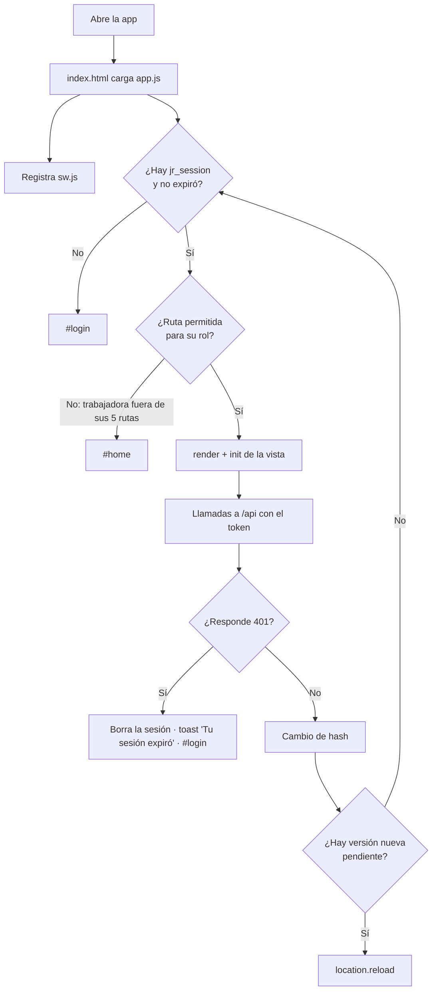

- **Entrada:** abrir la app o cambiar de hash.
- **Termina en:** la vista pedida, `#login` o `#home`.
- **Aristas:** sesión expirada en el navegador → login. Rol sin permiso → inicio. Token vencido en el servidor (401) → login con aviso.
- **Regla:** la expiración local sale del propio token, así que las dos siempre coinciden ([C4](#c4), resuelto).

## F1 · Entrar con PIN

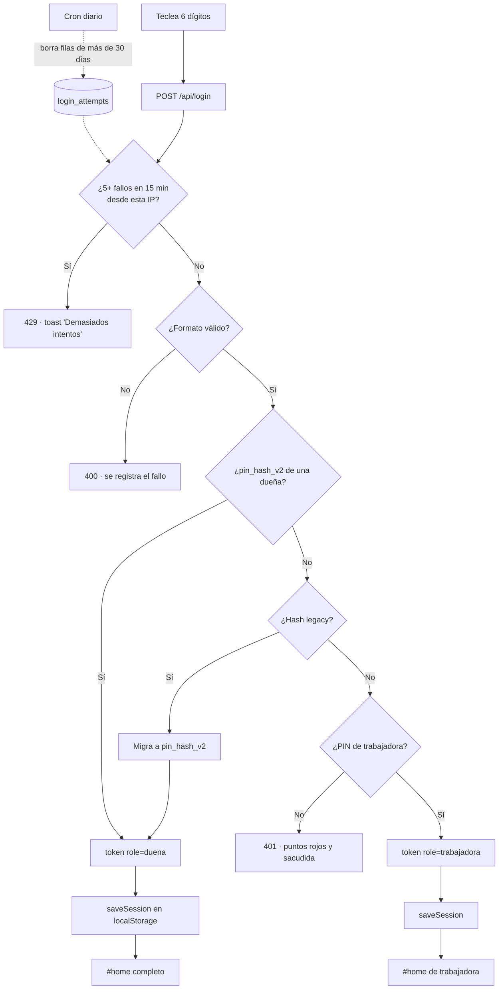

- **Tablas:** `login_attempts` (lee y escribe), `salones` (lee; escribe `pin_hash_v2` si migra).
- **Termina en:** inicio según el rol, o error en login.

## F2 · Face ID / Touch ID

**Activar (👑 desde Configuración, con sesión de PIN):**

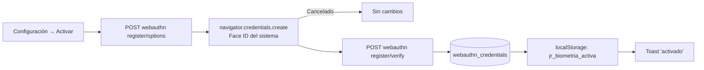

**Entrar:**

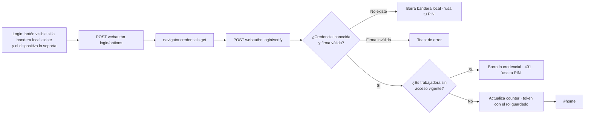

- **Quitar:** Configuración → Quitar → `DELETE /api/webauthn`. Si era este dispositivo, borra la bandera local.
- **Revocación:** quitarle el acceso a una trabajadora (o borrarla en Configuración) borra sus credenciales, y el login revisa que siga con acceso ([C8](#c8), resuelto).

## F3 · Registrar Cita

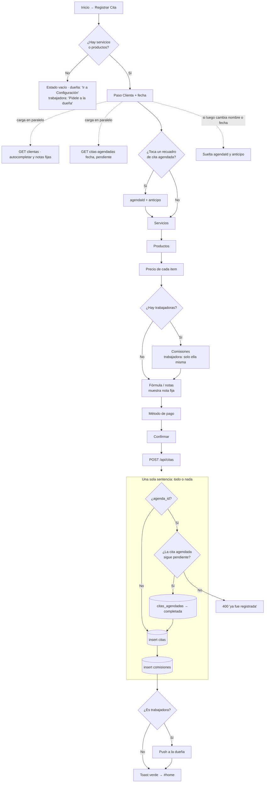

- **Entrada:** nombre, fecha, items con precio, comisiones, nota, método de pago.
- **Reglas:** al menos un servicio o producto. Con cita agendada: `total = suma − min(anticipo, suma)`; la comisión va sobre el precio completo.
- **Tablas:** `citas_agendadas` (update), `citas` (insert), `comisiones` (insert), `push_subscriptions` (lee).
- **Termina en:** inicio con toast verde. En error, se queda en Confirmar con el botón reactivado.
- **Entrada desde la Agenda:** `#cita?fecha=YYYY-MM-DD` abre el flujo en ese día, con sus recuadros de citas agendadas (así se cobra una cita "sin cerrar").
- **Resueltos:** [C3](#c3) (cobro atómico), [C7](#c7) (el vínculo se suelta si cambia el nombre o la fecha), [C10](#c10) (mensaje para la trabajadora sin catálogo).

## F4 · Agendar Cita

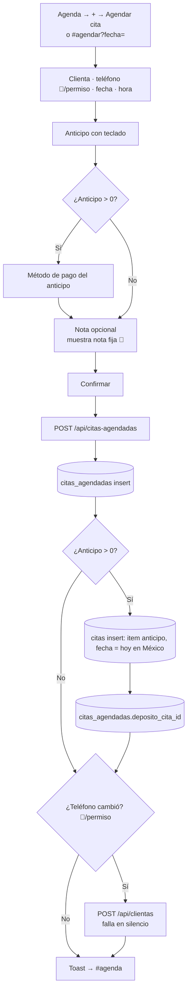

- **Tablas:** `citas_agendadas`, `citas` (si hay anticipo), `clientas` (si cambió el teléfono). Las tres primeras en una sola sentencia.
- **Teléfono:** lo ve la dueña, y una trabajadora solo si tiene el permiso "Teléfonos de clientas" (el servidor manda `permiso_telefonos`). Con permiso, la trabajadora también puede agregar el teléfono y "Confirmar por WhatsApp" desde el menú de una cita pendiente en la Agenda.
- **Termina en:** Agenda con la cita nueva.
- **Regla:** el servidor fecha el anticipo con `fechaMexico()` de `lib/fecha.js`, nunca con la fecha UTC ([C2](#c2), resuelto).

## F5 · Ciclo de vida de una cita agendada

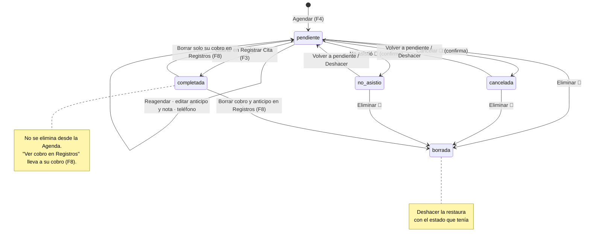

| Acción | Endpoint | Efecto en el dinero |
|---|---|---|
| Cancelar / No asistió | `PATCH {id, estado}` | El anticipo **se queda** como ingreso |
| Registrar cobro | Abre `#cita?fecha=` | El cobro de F3. Solo si está pendiente y su fecha ya llegó |
| Editar anticipo y nota | `PATCH {id, anticipo, anticipo_metodo_pago, timestamp, nota}` | Su fila de anticipo se corrige **en su mismo día**; si no había, entra hoy; en $0 se quita. No aplica a una completada |
| Ver cobro en Registros | Abre `#registros?fecha=&agenda=` | Ninguno. Solo en una completada: lleva a su cobro resaltado |
| Eliminar su cobro en Registros (F8) | `DELETE /api/citas {…, con_anticipo?}` | Solo el cobro: vuelve a **pendiente** y el anticipo se queda. Con anticipo: se borran anticipo y cita agendada ([C15](#c15)) |
| Eliminar | `DELETE {id}` | Borra solo la fila del **anticipo**. Una completada responde 400 |
| Deshacer eliminar | `PATCH {id, restore}` | Restaura la cita agendada y su anticipo |
| Confirmar por WhatsApp | Ninguno (abre `wa.me`) | Ninguno. Solo si hay teléfono y está pendiente |

- **Trabajadora:** ve la información de la cita y un botón "Cerrar". Nada más.
- **Sin cerrar (👑):** la vista Agenda muestra arriba las citas de días pasados que siguen pendientes, para cobrarlas, marcarlas como no asistió o cancelarlas.
- **Resueltos:** [C1](#c1) (una completada ya no se elimina desde la Agenda), [C14](#c14) (sección "Sin cerrar").
- **Resuelto:** [C15](#c15) (borrar su cobro ya no la deja completada sin cobro).

## F6 · Vacaciones y días libres

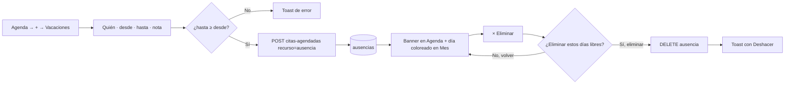

- **Resuelto:** [C11](#c11) (ya pide confirmación, como el resto de la Agenda).

## F7 · Registrar Gasto

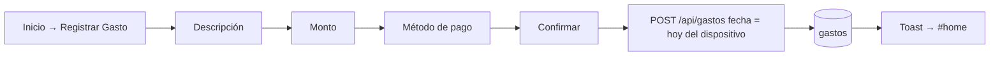

## F8 · Registros del día

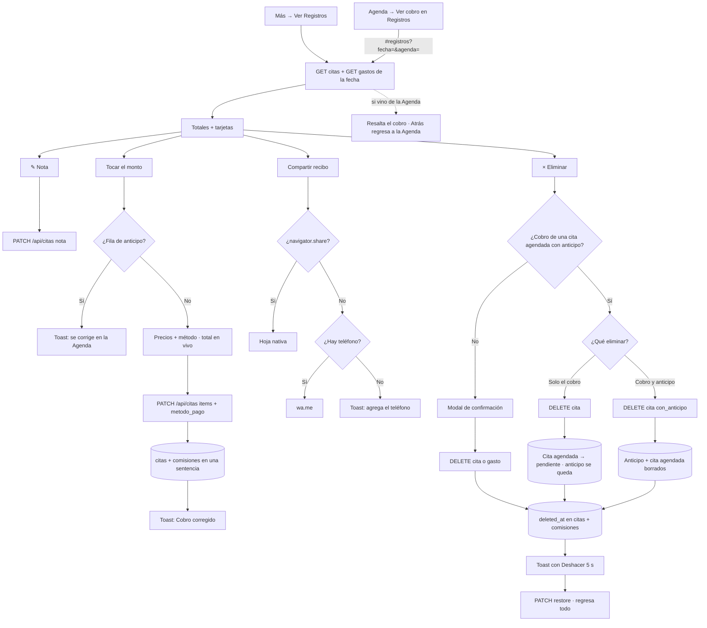

- **Corregir cobro:** solo precios de sus mismos items y método de pago. El servidor recalcula el total, vuelve a aplicar el anticipo de la cita agendada (`min(anticipo, suma)`) y recalcula sus comisiones con el mismo %.
- **Eliminar el cobro de una cita agendada:** sin anticipo, la confirmación avisa que la cita vuelve a pendiente. Con anticipo, pregunta "Solo el cobro" o "Cobro y anticipo". Todo en una sentencia con el mismo `deleted_at`; "Deshacer" regresa lo borrado en ese momento (409 si la cita ya se volvió a cobrar).
- **Resuelto:** [C15](#c15).

## F9 · Clientas

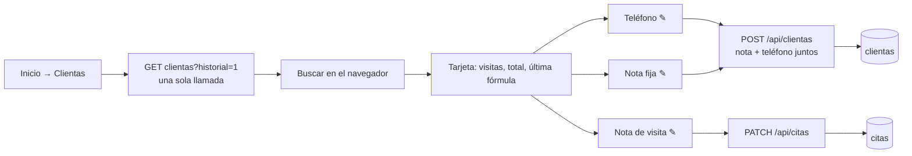

## F10 · Reportes

| Pantalla | Llamadas | Rango |
|---|---|---|
| Inicio (resumen) | `GET dashboard` + `GET comisiones` | Lunes a domingo de esta semana |
| Comisiones | `GET comisiones` | Editable. Default: semana actual |
| Dashboard | `GET dashboard` | Mes elegido. Mes actual llega hasta hoy |

Si el resumen del inicio falla, la tarjeta se oculta (no muestra error).

## F11 · Configuración

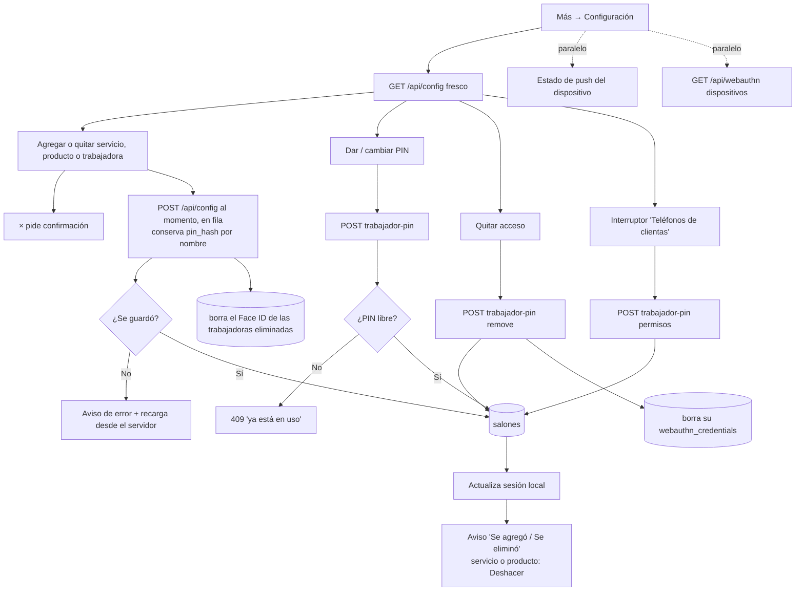

- **Sin botón "Guardar":** cada alta o baja se guarda sola. Los guardados van en fila y cada uno manda el catálogo completo, así dos cambios rápidos no se pisan.
- **Trabajadora recién agregada:** darle PIN espera a que termine su guardado (antes necesitaba "Guardar Cambios" o daba 404).
- **Permisos:** sección "Puede usar" en cada trabajadora. Se guardan al momento y el servidor los lee en cada llamada, así que valen sin que ella cierre sesión.
- **Deshacer:** solo para servicios y productos. Quitar a una trabajadora le borra PIN y Face ID en el servidor, por eso no se ofrece.
- **PIN libre:** se revisa contra dueñas (hash nuevo y legacy) y trabajadoras de todos los salones, excepto ella misma.
- **Resueltos:** [C4](#c4) (guardar ya no alarga la sesión local), [C8](#c8) (quitar acceso corta también su Face ID).

## F12 · Notificaciones push

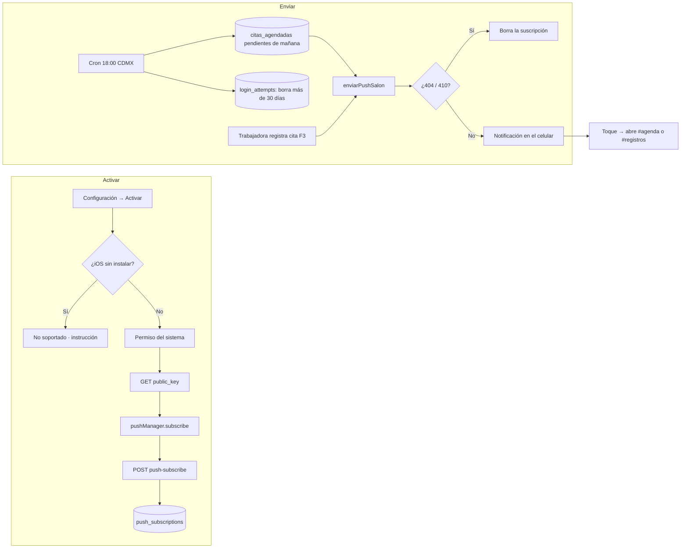

## F13 · Actualización de la app

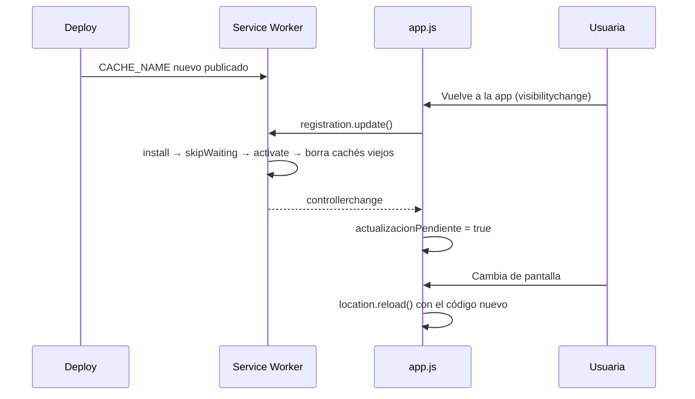

"Actualizar app" (Configuración o inicio de la trabajadora) hace lo mismo
al momento: `update()`, espera hasta 8 s a que el SW nuevo se active y recarga.

## Mapa del dinero

Dónde entra y dónde sale cada peso, y cómo se refleja en cada pantalla.

| Evento | Fila en `citas` | `fecha` | Registros | Dashboard ingresos | Dashboard citas | Comisiones |
|---|---|---|:---:|:---:|:---:|:---:|
| Cita normal | 1 (items servicio/producto) | La elegida | ✅ | ✅ | ✅ | Si se asignaron |
| Anticipo al agendar | 1 (item `anticipo`) | Hoy en México | ✅ | ✅ | ❌ | ❌ |
| Cobro de cita agendada | 1 (`total − anticipo`) | La elegida | ✅ con "Anticipo aplicado" | ✅ | ✅ | Sobre precio completo |
| Cancelar / No asistió | Sin cambio | | El anticipo sigue | ✅ | | |
| Eliminar cita agendada (no completada) | Borra solo su anticipo | | | | | Sin cambio (no tiene) |
| Eliminar cita agendada completada | No se permite (400) | | | | | |
| Corregir anticipo (Agenda) | Corrige su fila; si no había, 1 nueva; en $0 la quita | La del anticipo (nueva: hoy) | ✅ | ✅ | ❌ | ❌ |
| Corregir cobro (Registros) | Misma fila: precios, total y método | Sin cambio | ✅ | ✅ | ✅ | Mismo %, precio nuevo |
| Eliminar cita en Registros | Borra la fila | | | | | Se borran |
| Eliminar solo el cobro de una cita agendada | Borra el cobro; el anticipo se queda | | Anticipo sigue | Anticipo sigue | ❌ | Se borran |
| Eliminar cobro y anticipo | Borra cobro y anticipo (y la cita agendada) | | ❌ | ❌ | ❌ | Se borran |
| Gasto | `gastos` | Hoy del dispositivo | ✅ | Gastos | | |

`Ganancia neta = ingresos − gastos − comisiones`.

## Cabos sueltos

Lo que al recorrer los flujos quedó abierto, ambiguo o inconsistente.
**Los 14 primeros se resolvieron en la v46** (2026-09-26) y C15 en la v50. Cada uno tiene su prueba
automática o su recorrido en navegador (ver [Testing.md](Testing.md)). Si
aparece uno nuevo, agrégalo como el siguiente número (C16…) con estado "Abierto".

| # | Prioridad | Flujo | Estado |
|---|---|---|---|
| [C1](#c1) | 🔴 Alta | F5 | ✅ Resuelto (v46) |
| [C2](#c2) | 🔴 Alta | F4 | ✅ Resuelto (v46) |
| [C3](#c3) | 🟠 Media | F3 | ✅ Resuelto (v46) |
| [C4](#c4) | 🟠 Media | F0, F11 | ✅ Resuelto (v46) |
| [C5](#c5) | 🟠 Media | Operación | ✅ Resuelto (v46) |
| [C6](#c6) | 🟠 Media | Operación | ✅ Resuelto (v46) |
| [C7](#c7) | 🟠 Media | F3 | ✅ Resuelto (v46) |
| [C14](#c14) | 🟠 Media | F5 | ✅ Resuelto (v46) |
| [C8](#c8) | 🟡 Baja | F2, F11 | ✅ Resuelto (v46) |
| [C9](#c9) | 🟡 Baja | Todos | ✅ Resuelto (v46) |
| [C10](#c10) | 🟡 Baja | F3 | ✅ Resuelto (v46) |
| [C11](#c11) | 🟡 Baja | F6 | ✅ Resuelto (v46) |
| [C12](#c12) | 🟡 Baja | F1 | ✅ Resuelto (v46) |
| [C13](#c13) | 🟡 Baja | Base de datos | ✅ Resuelto (v46) |
| [C15](#c15) | 🟡 Baja | F8, F5 | ✅ Resuelto (v50) |

### C1

**Eliminar una cita agendada ya completada borra también el cobro de la visita.**
`DELETE /api/citas-agendadas` marca como borradas todas las filas de `citas`
con ese `agenda_id`. El cobro final (F3) también lleva ese `agenda_id`, no
solo el anticipo. Resultado: desaparece el ingreso real de la visita, pero sus
comisiones siguen contando (se enlazan por fecha/hora/clienta, no por
`agenda_id`). La Agenda muestra "Eliminar" en citas completadas y el texto de
confirmación solo menciona el anticipo.
**Propuesta:** no ofrecer "Eliminar" en una completada (el cobro se borra
desde Registros) y en el backend limitar el borrado a la fila del depósito
(`deposito_cita_id`), o rechazar el DELETE si `estado = 'completada'`.

**Resuelto en v46.** El DELETE rechaza una cita `completada` con 400 ("Esta cita ya se cobró…") y, como segunda barrera, solo borra la fila de `citas` que es anticipo (`items @> [{tipo: anticipo}]`). La Agenda ya no ofrece "Eliminar" en una completada y explica que el cobro se corrige en Ver Registros. Prueba: `test/api.test.js`.

### C2

**El anticipo se registra con la fecha UTC del servidor.**
`api/citas-agendadas.js` usa `new Date().toISOString().slice(0, 10)`. Entre
las 18:00 y las 23:59 de Ciudad de México eso ya es "mañana". Un anticipo
recibido a las 7 pm aparece en los Registros del día siguiente y puede caer
en otra semana o mes del Dashboard. Lo mismo pasa con `clientas.actualizado`.
**Propuesta:** reutilizar `fechaMexico()` de `api/cron/reminder-citas.js`
(moverla a `lib/`), o que el cliente mande su `fecha` como ya hace con gastos.

**Resuelto en v46.** Nueva `lib/fecha.js` con `fechaMexico()`. La usan el anticipo, `clientas.actualizado` y el cron. Prueba: `test/api.test.js` (casos a las 19:00 de México y cambios de mes y año).

### C3

**Cobrar una cita agendada no es atómico.**
`POST /api/citas` primero marca la cita agendada como `completada` y después
inserta la cita y las comisiones en sentencias separadas. Si el insert falla,
la cita agendada queda completada sin cobro y un reintento responde "ya fue
registrada".
**Propuesta:** una sola sentencia con CTEs (como ya se hace al agendar con anticipo).

**Resuelto en v46.** `POST /api/citas` marca la cita agendada, inserta el cobro e inserta las comisiones en una sola sentencia con CTEs. Si algo falla, no queda nada a medias. `agenda_id` se valida como uuid (antes un id mal formado daba 500). Prueba: `test/api.test.js` fuerza una falla en comisiones y revisa que la cita agendada siga pendiente.

### C4

**Token vencido sin salida a login.**
`fetchAPI` no distingue el 401. Además, "Guardar Cambios" en Configuración
llama `saveSession()`, que renueva `expires_at` 8 horas más en el navegador
aunque el token del servidor no cambia. Pasadas las 8 h del login, la app
cree que sigue en sesión y cada pantalla muestra "Error al cargar…".
**Propuesta:** en `fetchAPI`, ante un 401 con token, hacer `logout()` y
mandar a `#login` con un toast. Y que `saveSession` conserve `expires_at` al
actualizar datos.

**Resuelto en v46.** `fetchAPI` trata el 401 con token: borra la sesión, avisa "Tu sesión expiró" y manda a Login. `saveSession` toma la expiración del propio token, así que guardar Configuración ya no alarga la sesión local. Probado en navegador.

### C5

**`crear-salon --plantilla` copia los PINs de las trabajadoras.**
Copia el arreglo `trabajadoras` completo, con `pin_hash`. Quedan dos salones
con PINs idénticos y el login entra al primero que encuentre.
**Propuesta:** copiar solo `{nombre}`.

**Resuelto en v46.** La plantilla copia solo `{nombre}` de cada trabajadora.

### C6

**`crear-salon --pin` no revisa si el PIN ya existe.**
`trabajador-pin.js` sí lo revisa. El script no.
**Propuesta:** la misma consulta de `en_uso` antes de insertar.

**Resuelto en v46.** `pinEnUso()` en `lib/auth.js` lo usan el script y `trabajador-pin.js`. De paso corrige dos detalles del chequeo anterior: comparaba el hash legacy contra el hash con pepper (nunca coincidía) y excluía a cualquier trabajadora con el mismo nombre en otro salón. Prueba: `test/api.test.js`.

### C7

**Registrar Cita conserva el vínculo con la cita agendada aunque cambies el nombre.**
Si tocas un recuadro de cita agendada, regresas al primer paso y escribes
otra clienta, `agendaId` se queda. El cobro de la clienta nueva completa la
cita agendada de la otra y le descuenta su anticipo.
**Propuesta:** limpiar `agendaId` y `anticipoAgenda` cuando el nombre o la
fecha ya no coinciden con la cita agendada elegida.

**Resuelto en v46.** Al avanzar del primer paso, si el nombre (normalizado) o la fecha ya no son los de la cita agendada elegida, se sueltan `agendaId` y su anticipo. Probado en navegador contra la base: el cobro de otra clienta queda sin `agenda_id` y la cita agendada sigue pendiente.

### C8

**Quitar acceso o borrar una trabajadora no borra su Face ID.**
`webauthn_credentials` guarda `role` y `worker` y el login con Face ID no
revisa que ella siga en el catálogo con acceso. Hoy es poco probable porque
la UI solo permite registrar Face ID desde Configuración (solo dueña), pero la
API sí lo permite a una trabajadora.
**Propuesta:** al verificar el login de trabajadora, confirmar que su nombre
sigue en `salones.trabajadoras` con `pin_hash`. Borrar sus credenciales al
quitar el acceso.

**Resuelto en v46.** Quitar acceso borra sus credenciales; borrar a la trabajadora en Configuración también. Y el login con Face ID de una trabajadora revisa que siga con PIN; si no, borra la credencial y responde 401 (el frontend deja de ofrecer Face ID). Prueba: `test/api.test.js`.

### C9

**`fetchAPI` asume que toda respuesta es JSON.** Un 502/504 de Vercel con
HTML hace que `response.json()` truene y el mensaje real se pierda.
**Propuesta:** leer como texto, intentar JSON y caer a un mensaje genérico.

**Resuelto en v46.** `fetchAPI` lee la respuesta como texto e intenta JSON. Si no lo es, muestra un mensaje según el código (503 sin conexión, 5xx el servidor no respondió). Probado en navegador con un 502 en HTML.

### C10

**Trabajadora en un salón sin catálogo ve "Ir a Configuración".** Al tocarlo,
el router la regresa al inicio sin explicación.
**Propuesta:** para ella, mostrar "Pídele a la dueña que agregue servicios".

**Resuelto en v46.** Para la trabajadora: "Todavía no hay servicios ni productos en el salón. Pídele a la dueña que los agregue.", sin botón.

### C11

**Borrar una ausencia no pide confirmación.** Todo lo demás en la Agenda sí
la pide desde la v43. Tiene "Deshacer", pero rompe la regla del design system.

**Resuelto en v46.** La × abre "¿Eliminar estos días libres?" con quién, rango y nota, y los botones "No, volver" y "Sí, eliminar". Sigue ofreciendo "Deshacer".

### C12

**`login_attempts` nunca se limpia.** Crece con cada intento.
**Propuesta:** borrar filas de más de 30 días (en el cron diario, por ejemplo).

**Resuelto en v46.** El cron diario borra las filas de más de 30 días (en su propio `try`, no afecta los recordatorios) y reporta `intentos_borrados`. Prueba: `test/api.test.js`.

### C13

**Las tablas base no tienen DDL en el repo.** No se puede levantar una base
desde cero solo con `scripts/migrations/`.
**Propuesta:** exportar el esquema real a `000_base.sql`.

**Resuelto en v46.** `scripts/migrations/000_base.sql`, exportado de la base real en Neon. Con 000 a 007 se levanta la base completa; las pruebas de integración lo hacen en cada corrida.

### C14

**Las citas agendadas vencidas se quedan en "pendiente" para siempre.**
La vista Agenda empieza en hoy, así que una cita de ayer que nunca se cobró
ni se marcó desaparece de la lista (solo se ve en Mes). No hay recordatorio
ni cierre automático, y el anticipo queda sin conciliar.
**Propuesta:** sección "Sin cerrar" en la Agenda con pendientes de fechas
pasadas, para marcarlas como cobradas, no asistió o canceladas.

**Resuelto en v46.** La vista Agenda (dueña) muestra arriba "Sin cerrar (N)" con las pendientes de días pasados. Su menú agrega "Registrar cobro", que abre Registrar Cita en ese día con su recuadro listo. Probado en navegador.

### C15

**Borrar el cobro de una cita agendada la deja "Completada" sin cobro.**
`DELETE /api/citas` no toca `citas_agendadas`: la cita sigue `completada`,
ya no se puede volver a cobrar ni eliminar desde la Agenda, y "Ver cobro en
Registros" avisa que no encuentra el cobro. Antes de la v50 corregir un
monto obligaba a borrar y volver a registrar; desde la v50 el cobro se
corrige sin borrarlo, así que pasa mucho menos.
**Propuesta:** al borrar un cobro con `agenda_id`, regresar su cita agendada
a `pendiente` en la misma sentencia (y a `completada` con "Deshacer").

**Resuelto en v50.** Eliminar ese cobro en Registros pregunta, si hay anticipo, "Solo el cobro" (la cita vuelve a pendiente y el anticipo se queda) o "Cobro y anticipo" (se borran también el anticipo y la cita agendada). Una sola sentencia con el mismo `deleted_at`; "Deshacer" regresa todo y responde 409 si la cita ya se volvió a cobrar. Pruebas: `test/api.test.js` (C15).
